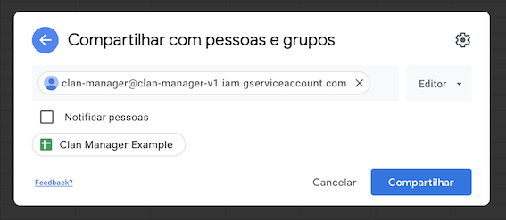

# ⚔️ Clash of Clans - Clan Manager

Automatically fills a Google Sheet with your clan data.

This is currently made for my clan needs, but if you want to know more about it, feel free to contact me (because it's very unlikely that I will keep this README updated 🙃).

## How to create a sheet for your clan

Share your sheet with `clan-manager@clan-manager-v1.iam.gserviceaccount.com`, giving it editor access.



Create a `json` file to configure the app. See the `Setup fields description` and `Example setup json` section below for details.

Send me the `json` file via [telegram](https://www.t.me/wdsrocha) or [email](mailto:wesleysr1997@gmail.com) so I can run the script for you (yes, this terrible 🤠).

> If you want to do it yourself, see [here](https://medium.com/@williamchislett/writing-to-google-sheets-api-using-net-and-a-services-account-91ee7e4a291) a nice tutorial on how to use google sheet API with write access (note that you will need to share the sheet with **your** service account) and create a [new COC key](https://developer.clashofclans.com/#/new-key). Clone this repository, remove the "example" inside `coc_credentials.example.json` and `google_credentials.example.json` and substitute their content. After that, just run `dotnet run -- your_setup_file.json`.

## Setup fields description

### spreadsheetId

The random string at the end of your sheet URL.

For example, for `https://docs.google.com/spreadsheets/d/13Iwi6uGG-zRzu10nrGHwhdSmuUI3JoonG4WrE5fi4n0` the `spreadsheetId` would be `13Iwi6uGG-zRzu10nrGHwhdSmuUI3JoonG4WrE5fi4n0`.

### clanTag

The clan tag. You can check it below your clan name ingame.


### page

The page name that shows up at the bottom of the sheet. This can be useful if your clan has one or more "auxiliary" clans and you want to keep everything in the same sheet but in different pages.


### columns

List of columns.

A column consists of `name` and `label` keys.

- `name`: original names on the [COC API Documentation](https://developer.clashofclans.com/#/documentation) (i.e.: "Barbarian King", "Earthquake Spell", etc) which isn't explicit and you'll probably have to guess basing yourself on the names at [COC wiki](https://clashofclans.fandom.com/pt-br/wiki/Wiki_Clash_of_Clans) 😔.
- `label`: this is what will be displayed on the sheet. Cool if you want to translate or use abbreviations.

## Example setup json

```json
{
  "spreadsheetId": "13Iwi6uGG-zRzu10nrGHwhdSmuUI3JoonG4WrE5fi4n0",
  "clanTag": "#YVOPROUY",
  "page": "MEGA EMPIRE BR",
  "columns": [
    { "name": "Name", "label": "Nome do jogador" },
    { "name": "Town Hall", "label": "Nível CV" },
    { "name": "Barbarian King", "label": "Rei" },
    { "name": "Archer Queen", "label": "Rainha" },
    { "name": "Grand Warden", "label": "Guardião" },
    { "name": "Royal Champion", "label": "Campeã" }
  ]
}
```

This will produce the following (without styling 🙃):


