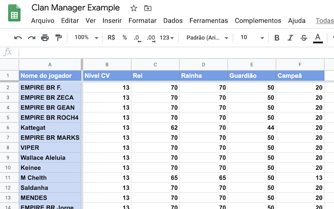
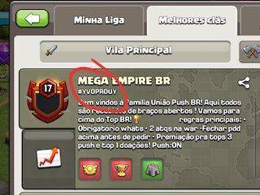
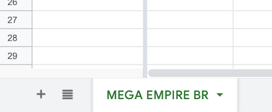

# ⚔️ Clash of Clans - Clan Manager

  
Automatically fills a Google Sheet with your clan data.

  

---

In order to create one for your clan, follow the steps below.

1. Create a new Google Sheet
1. Turn on write access to your Google Sheet ([tutorial][1])
1. Create a `google_credentials.json` file based on `google_credentials.example.json` using the Google API Credentials data from the previous step
1. [Create a Clash of Clans API key on their developer website][2]
1. Create a `coc_credentials.json` file based on `coc_credentials.example.json` using the API key from the previous step
1. Create a `setup.json` file based on `setup.example.json`. [See the fields descriptions for more details][3]
1. Run `dotnet run -- setup.json` in your terminal

With all steps done properly, you should be able to see the Google Sheet populated with your clan data. If this does not work for any reason, feel free to [contact me][email].

[1]: https://medium.com/@williamchislett/writing-to-google-sheets-api-using-net-and-a-services-account-91ee7e4a291
[2]: https://developer.clashofclans.com/#/new-key
[3]: #setup-fields-description
[email]: mailto:hi@wdsrocha.com

## Setup fields description

### spreadsheetId

The random string at the end of your sheet URL.

For example, for `https://docs.google.com/spreadsheets/d/13Iwi6uGG-zRzu10nrGHwhdSmuUI3JoonG4WrE5fi4n0` the `spreadsheetId` would be `13Iwi6uGG-zRzu10nrGHwhdSmuUI3JoonG4WrE5fi4n0`.

### clanTag

The clan tag. You can check it below your clan name ingame.

### page

The page name that shows up at the bottom of the sheet. This can be useful if your clan has one or more "auxiliary" clans and you want to keep everything in the same sheet but in different pages.

### columns

List of columns.

A column consists of `name` and `label` keys.

- `name`: original names on the [COC API Documentation](https://developer.clashofclans.com/#/documentation) (i.e.: "Barbarian King", "Earthquake Spell", etc) which isn't explicit and you'll probably have to guess basing yourself on the names at [COC wiki](https://clashofclans.fandom.com/pt-br/wiki/Wiki_Clash_of_Clans) 😔.
- `label`: this is what will be displayed on the sheet. Cool if you want to translate or use abbreviations.
